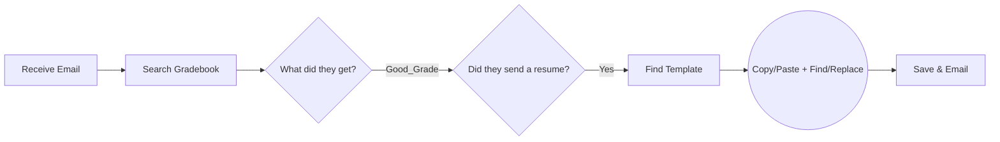

```mermaid
graph LR
    Trigger[Receive Email] --> Step1[Search Gradebook]
    Step1 --> Decision1{"What did they get?"}
    Decision1 --Good_Grade--> Decision2{"Did they send a resume?"}
    Decision2 --Yes--> Step2[Find Template]
    Step2 --> PainPoint((Copy/Paste + Find/Replace))
    PainPoint --> Step3[Save & Email]
```
