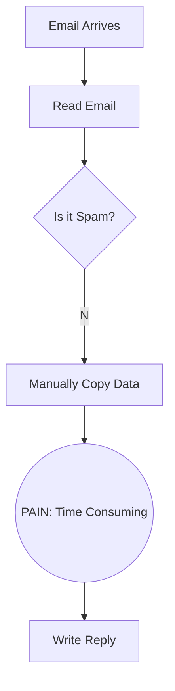

# Process Design Document (PDD) - Milestone 1: Process Analysis
**Team Name:**
**Project Title:** (e.g., The LinkedIn Job Matcher)
**Target Workflow:** (Personal/Professional Daily Task)

---

## Part 1: Process Mapping (The "As-Is" State)
*Grading Criteria: Diagram is clear, accurate, and highlights pain points.*

### 1.1 The Scenario
*(Briefly describe the manual process as it exists today. Who does it? When? What triggers it?)*

### 1.2 The "As-Is" Diagram (Mermaid)
*(Use ChatGPT to help you generate a `graph TD` flow chart of the current MANUAL steps. You must clearly label the manual bottlenecks.)*

### 1.3 Pain Point Diagnosis
*   **The Bottleneck:** (Which specific step in the diagram is the slowest or most error-prone?)
*   **The Cost:** (Quantify the pain: e.g., "5 hours/week" or "Error rate of 20%").

---

## Part 2: Opportunity Analysis (The Business Case)
*Grading Criteria: Logically justifies why this is a good fit for GenAI.*

### 2.1 The 3-Filter Analysis
*   **Value:** (Is it repetitive? Is the "Cost" defined above high enough to justify building a bot?)
*   **Feasibility:** (Is the input data text-based? Do you have access to the rules/context needed to make decisions?)
*   **Risk:** (What happens if the AI hallucinates? Is this a "Game Over" scenario or just a minor annoyance?)

### 2.2 The "Why AI?" Justification
*(Explain why Standard Software (like Excel formulas) isn't enough. Does this task require "Reasoning," "Summarization," or "Tone Adjustment"?)*

---

## Part 3: Scope of Automation (The Setup for Week 3)
*Grading Criteria: Identifies relevant automation opportunities.*

### 3.1 The Target Zone
*(Look at your diagram in Part 1.2 (_The Minimal Viable Workflow_). Which specific nodes will you replace with AI in Week 3?)*
*   **We will replace:** [Step Name]
*   **We will keep human:** [Step Name]

### 3.2 The Hypothesis
*   "By automating [Step X], we expect to reduce the time spent from [Current Time] to [Target Time]."
*  **HINT**: Refer to your Segment 1 interview notes where you discussed 'Hours Saved' and 'Cost of Error' to fill this out.
> EXAMPLE: _By implementing an AI Context Guardian to cross-reference meeting transcripts with the Master Budget Excel, we will reduce the budget reconciliation time from 2 hours to 30 seconds and reduce the financial risk of unauthorized shifts to near zero._
