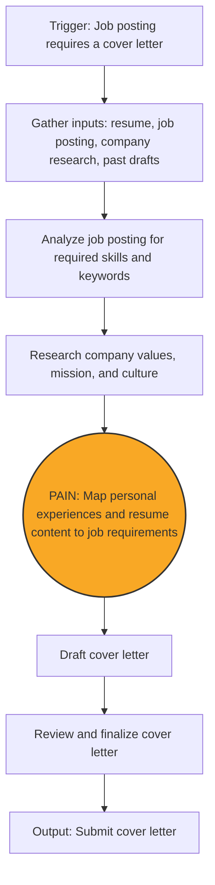

# Process Design Document (PDD) - Milestone 1: Process Analysis
**Team 3:**
**AI Assisted Cover Letter Draft:**
Professional job application task – drafting cover letters 

---

## Part 1: Process Mapping (The "As-Is" State)

### 1.1 The Scenario
Individuals preparing to enter the workforce, recent graduates, and job seekers who are unemployed or seeking new roles manually write and tailor cover letters as part of the job application process. This workflow is triggered when a job posting explicitly requires a cover letter for submission. Upon encountering such a posting, the applicant gathers relevant inputs, including their resume, the job description, company information, and any existing cover letter drafts. The applicant then manually analyzes the job requirements, researches the organization’s values and expectations, and cognitively maps their personal skills and experiences to the role’s qualifications. Based on this analysis, the applicant drafts and reviews a cover letter, often investing significant time and effort for roles of high interest. However, when applying to multiple positions within a limited timeframe, this same process must be repeated across many applications, making it difficult to consistently produce highly tailored cover letters at scale. The process is entirely manual, relies heavily on individual judgment and cognitive effort, and is repeated multiple times during active job search periods.

### 1.2 The "As-Is" Diagram (Mermaid)

### 1.3 Pain Point Diagnosis
*   **The Bottleneck:** Mapping job requirements to personal experiences (highest pain score: 9/10; requires reasoning and synthesis, and is identified as the primary bottleneck that slows applications and degrades quality).
*   **The Cost:** Approximately 3–5 hours per week spent on cover letter preparation; target improvement is reducing this to under 2–3 hours per week (a 30–50% reduction).

---

## Part 2: Opportunity Analysis (The Business Case)
*Grading Criteria: Logically justifies why this is a good fit for GenAI.*

### 2.1 The 3-Filter Analysis
*   **Value:** Yes, this step exhibits high frequency and high friction. Each job application requires a new, personalized cover letter, and the user typically submits 3–5 applications per week, resulting in repeated execution of the same cognitively demanding task. Writing each cover letter takes approximately one hour, leading to a total cost of 3–5 hours per week. The task also has high friction: mapping job requirements to personal experiences requires sustained reasoning, synthesis, and judgment, which users consistently report as mentally exhausting and difficult to scale when applying to multiple roles at once. While the content varies by job, the underlying task—determining how personal experiences align with role requirements—is repeated frequently and at meaningful volume. The combination of high repetition, high cognitive burden, and measurable time cost makes this step a strong candidate for automation and justifies the ROI of building an AI-assisted solution.
*   **Feasibility:** The workflow is feasible for AI assistance because all required inputs are text-based and readily available. Job postings, resumes, and company descriptions are already provided in digital text form, allowing an AI system to ingest and process them without additional data collection. The decision-making context—identifying which personal experiences align with specific job requirements—relies on interpreting and comparing unstructured text, a task well-suited to reasoning-based AI. The necessary “rules” are implicit rather than fixed, consisting of relevance, skill alignment, and narrative fit, which can be inferred from the provided documents. Because applicants already supply the full context needed to make these decisions and retain human review before submission, the task is both technically and operationally feasible for AI support.
*   **Risk:** The primary risk is that the AI may inaccurately select or misrepresent skills or experiences when mapping job requirements to personal background. This could result in a cover letter that overstates qualifications or highlights irrelevant experiences. However, this is not a “game over” scenario, because the workflow retains human-in-the-loop review before submission. Errors can be identified and corrected by the applicant, limiting the impact to a minor annoyance or a need for revision rather than irreversible harm.

### 2.2 The "Why AI?" Justification
Standard software tools are insufficient for this task because the core challenge is not deterministic processing but reasoning and synthesis. Mapping job requirements to personal experiences requires interpreting unstructured text, judging relevance, and making contextual tradeoffs between multiple possible experiences. These decisions cannot be expressed as fixed rules or formulas without losing nuance.

The task also involves language generation and narrative construction, requiring the ability to explain why certain experiences align with a role and to adapt wording across different job contexts. Traditional software excels at validation and formatting but cannot perform contextual reasoning or generate coherent, role-specific explanations. Reasoning-based AI is therefore necessary to support this workflow, with human oversight retained to manage accuracy and tone.

---

## Part 3: Scope of Automation (The Setup for Week 3)
The relevant automation opportunity within this workflow is the step of mapping job requirements to personal experiences. This activity has the highest documented pain score (9/10) and represents the primary bottleneck in the AS-IS process due to its high cognitive load, time intensity, and reliance on reasoning and synthesis across unstructured text. It is repeated across applications and directly contributes to the 3–5 hours per week spent on cover letter preparation.

Automation will be scoped to assist this specific reasoning task, using AI to support the alignment of job requirements with relevant experiences. Other steps in the workflow—such as reviewing, editing, and finalizing the cover letter—will remain human-controlled due to their lower pain scores and the need to manage risks related to accuracy and personal representation. By clearly identifying this high-impact, reasoning-heavy step as the automation target and explicitly excluding lower-value or higher-risk steps, the project identifies a focused and defensible automation opportunity consistent with the grading criteria.

### 3.1 The Target Zone

*   **We will replace:** [Map personal experiences and resume content to job requirements]
*   **We will keep human:** [Review and finalize cover letter]

### 3.2 The Hypothesis
*   By automating the step of mapping job-posting requirements to personal experiences, we expect to reduce the time spent on cover letter preparation from approximately 3–5 hours per week to under 2–3 hours per week, representing a 30–50% reduction. This improvement is expected to increase application throughput without degrading quality, while improving perceived personalization and reducing reliance on generic or reused drafts.
  
