# Process Definition Document (PDD) - Phase 1: Analysis

**Project Title:** Project Nova Financial Automation

**Status:** Phase 1 Complete (AS-IS Analysis)

---

## 1. Process Discovery & Mapping

### 1.1 The Scenario
The Project Nova team is currently "drowning" in manual administrative overhead. Every Friday, the Project Lead (Priya) spends 4 hours manually reconciling budget shifts. The process involves:
- Manually reformatting messy vendor CSVs.
- Cross-referencing "The Big Sheet" on SharePoint for overhead limits.
- Searching a 60-page PDF (MSA) for compliance clauses.
- Any error results in a potential $5,000 - $10,000 unauthorized spend.

### 1.2 Current Process Map (As-Is)

```mermaid
flowchart TD
    A[⚡ Receipt of Vendor CSV / Status Meeting Notes] --> B[📦 Vendor CSV & Meeting Notes]
    B --> C[🛠️ Manual CSV Reformat & Spend Assessment]
    C --> G[🛠️ Budget Reconciliation]
    style G fill:#f90
    G --> D{💎 Is Budget OK?}
    D -- No --> E[🏁 End Process]
    D -- Yes --> F[🛠️ Draft Status Update Email]
    F --> H[⚡ End of Meeting]
```

---

## 2. The Business Case

### 2.1 ROI Analysis Table
| Activity | Pain (1-10) | Feasibility (1-10) | Risk (1-10) | Rationale |
| :--- | :---: | :---: | :---: | :--- |
| CSV Reformatting | 9 | 8 | 7 | High repetition; Alex spends hours on data cleaning. |
| Overhead Calculation | 8 | 7 | 8 | 4+ hours weekly; high risk of miscalculating limits. |
| MSA PDF Search | 7 | 9 | 5 | Semantic search is high feasibility; saves Maria 30m/check. |
| Status Drafting | 6 | 8 | 4 | Low risk; high feasibility for LLM generation. |

### 2.2 AI Suitability Analysis
- **Unstructured Data:** The meeting transcript and 60-page MSA PDF are unstructured. Traditional code cannot parse "Priya's intent" or "Legal language" without an LLM.
- **Reasoning Complexity:** Determining if a shift over $5k triggers an MSA clause requires context-aware logic (Fuzzy Reasoning), not just a math check.

---

## 3. Solution Strategy

### 3.1 Target Zone (The MVW)
The **Minimal Viable Workflow (MVW)** will target **Step G: Budget Reconciliation**. 
- **Trigger:** Meeting Transcript notes a budget shift.
- **Goal:** Automate the logic check against the $10k limit and $5k MSA rule.

### 3.2 Business Hypothesis
> By implementing an LLM-driven automation for Project Nova’s financial reconciliation, the team will reduce weekly manual effort by 5–8 hours and mitigate human errors costing up to $10k per incident.
