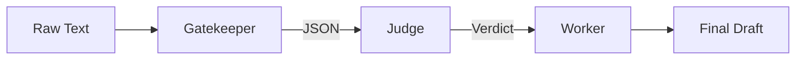

#  Process Design Document (PDD) - Milestone 2: MVW Design


### Process Design Document (PDD) - Phase 1 Complete
**Team Name:**

**Project Title:**

**Status:** Milestone 2 (Solution Design)

---

## [Part 1: Process Analysis]
*(Leave your Week 2 work here: As-Is Map, Business Case, etc.)*

---

## Part 2: The "To-Be" Solution (Milestone 2)

### 2.1 The "To-Be" Map
*(Paste the Mermaid `graph TD` code for your Linear Assembly Line. It should look like a pipeline, not a spaghetti mess.)*



---

### 2.2 The R.A.F.T. Implementation (The Prompts)
*Draft your System Prompts first. These are the instructions you give the AI.*

**Prompt 1 (Gatekeeper):**
> **Role:** ...
> **Audience:** ...
> **Format:** ...
> **Task:** ...

**Prompt 2 (Judge):**
> **Role:** ...
> **Audience:** ...
> **Format:** ...
> **Task:** ...

**Prompt 3 (Worker):**
> **Role:** ...
> **Audience:** ...
> **Format:** ...
> **Task:** ...

---

### 2.3 The Tool Specifications (The Engineer's Audit)
*Now, audit your prompts above against these strict Engineering Specs. Does your prompt actually deliver what the Spec demands?*

#### **Tool A: The Gatekeeper (Extraction)**
*   **Goal:** Extract structured data from chaos.
*   **Input Variable:** `{{input_text}}` (String)
*   **Output Schema (JSON):**
    *   `key_1`: (type)
    *   `key_2`: (type)
*   **Failure Mode:** If data is missing, output `null`.

#### **Tool B: The Judge (Reasoning)**
*   **Goal:** Apply rules to the data.
*   **Input Variable:** `{{extracted_json}}`
*   **Context Rules:** (Link to your policy/rubric)
*   **Output Schema (XML):** `<thinking>` and `<verdict>`

#### **Tool C: The Worker (Drafting)**
*   **Goal:** Generate the human-facing result.
*   **Input Variable:** `{{verdict}}`
*   **Tone/Style:** (e.g., Professional, no jargon)

---

### 2.4 "Proof of Life" (Simulation Log)
*Paste the transcript from your Manual Simulation or Auto-Simulator. Prove that Data flowed from Node 1 -> Node 2 -> Node 3 without crashing.*

> **Input:** ...
> **Node 1 Output:** ...
> **Node 2 Verdict:** ...
> **Final Output:** ...

---

### 2.5 Value Definition (The KPI Dashboard)
*How will we measure success?*

| Metric Category | Current State (As-Is) | Target State (To-Be) | Estimated Impact |
| :--- | :--- | :--- | :--- |
| **Efficiency (Time)** | e.g., 20 mins/task | 1 min/task | **95% Reduction** |
| **Quality (Error)** | e.g., 10% typo rate | 0% typo rate | **Eliminated Risk** |
| **Cost (Optional)** | e.g., $50/hr labor | $0.05 API cost | **High ROI** |
```
