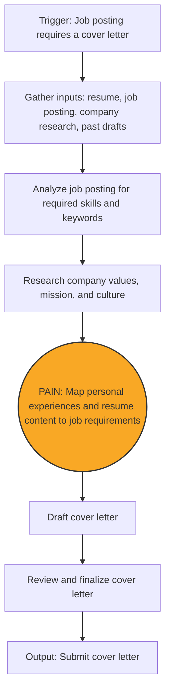

#  Process Design Document (PDD) - Milestone 2: MVW Design


### Process Design Document (PDD) - Phase 1 Complete
**Team 3**

**AI Assisted Cover Letter Draft:**

**Status:** Milestone 2 (Solution Design)

---

## Part 1: Process Analysis
Part 1: Process Mapping (The "As-Is" State)
1.1 The Scenario
Individuals preparing to enter the workforce, recent graduates, and job seekers who are unemployed or seeking new roles manually write and tailor cover letters as part of the job application process. This workflow is triggered when a job posting explicitly requires a cover letter for submission. Upon encountering such a posting, the applicant gathers relevant inputs, including their resume, the job description, company information, and any existing cover letter drafts. The applicant then manually analyzes the job requirements, researches the organization’s values and expectations, and cognitively maps their personal skills and experiences to the role’s qualifications. Based on this analysis, the applicant drafts and reviews a cover letter, often investing significant time and effort for roles of high interest. However, when applying to multiple positions within a limited timeframe, this same process must be repeated across many applications, making it difficult to consistently produce highly tailored cover letters at scale. The process is entirely manual, relies heavily on individual judgment and cognitive effort, and is repeated multiple times during active job search periods.

1.2 The "As-Is" Diagram (Mermaid)


1.3 Pain Point Diagnosis
The Bottleneck: Mapping job requirements to personal experiences (highest pain score: 9/10; requires reasoning and synthesis, and is identified as the primary bottleneck that slows applications and degrades quality).
The Cost: Approximately 3–5 hours per week spent on cover letter preparation; target improvement is reducing this to under 2–3 hours per week (a 30–50% reduction).
Part 2: Opportunity Analysis (The Business Case)
Grading Criteria: Logically justifies why this is a good fit for GenAI.

2.1 The 3-Filter Analysis
Value: Yes, this step exhibits high frequency and high friction. Each job application requires a new, personalized cover letter, and the user typically submits 3–5 applications per week, resulting in repeated execution of the same cognitively demanding task. Writing each cover letter takes approximately one hour, leading to a total cost of 3–5 hours per week. The task also has high friction: mapping job requirements to personal experiences requires sustained reasoning, synthesis, and judgment, which users consistently report as mentally exhausting and difficult to scale when applying to multiple roles at once. While the content varies by job, the underlying task—determining how personal experiences align with role requirements—is repeated frequently and at meaningful volume. The combination of high repetition, high cognitive burden, and measurable time cost makes this step a strong candidate for automation and justifies the ROI of building an AI-assisted solution.
Feasibility: The workflow is feasible for AI assistance because all required inputs are text-based and readily available. Job postings, resumes, and company descriptions are already provided in digital text form, allowing an AI system to ingest and process them without additional data collection. The decision-making context—identifying which personal experiences align with specific job requirements—relies on interpreting and comparing unstructured text, a task well-suited to reasoning-based AI. The necessary “rules” are implicit rather than fixed, consisting of relevance, skill alignment, and narrative fit, which can be inferred from the provided documents. Because applicants already supply the full context needed to make these decisions and retain human review before submission, the task is both technically and operationally feasible for AI support.
Risk: The primary risk is that the AI may inaccurately select or misrepresent skills or experiences when mapping job requirements to personal background. This could result in a cover letter that overstates qualifications or highlights irrelevant experiences. However, this is not a “game over” scenario, because the workflow retains human-in-the-loop review before submission. Errors can be identified and corrected by the applicant, limiting the impact to a minor annoyance or a need for revision rather than irreversible harm.
2.2 The "Why AI?" Justification
Standard software tools are insufficient for this task because the core challenge is not deterministic processing but reasoning and synthesis. Mapping job requirements to personal experiences requires interpreting unstructured text, judging relevance, and making contextual tradeoffs between multiple possible experiences. These decisions cannot be expressed as fixed rules or formulas without losing nuance.

The task also involves language generation and narrative construction, requiring the ability to explain why certain experiences align with a role and to adapt wording across different job contexts. Traditional software excels at validation and formatting but cannot perform contextual reasoning or generate coherent, role-specific explanations. Reasoning-based AI is therefore necessary to support this workflow, with human oversight retained to manage accuracy and tone.

Part 3: Scope of Automation (The Setup for Week 3)
The relevant automation opportunity within this workflow is the step of mapping job requirements to personal experiences. This activity has the highest documented pain score (9/10) and represents the primary bottleneck in the AS-IS process due to its high cognitive load, time intensity, and reliance on reasoning and synthesis across unstructured text. It is repeated across applications and directly contributes to the 3–5 hours per week spent on cover letter preparation.

Automation will be scoped to assist this specific reasoning task, using AI to support the alignment of job requirements with relevant experiences. Other steps in the workflow—such as reviewing, editing, and finalizing the cover letter—will remain human-controlled due to their lower pain scores and the need to manage risks related to accuracy and personal representation. By clearly identifying this high-impact, reasoning-heavy step as the automation target and explicitly excluding lower-value or higher-risk steps, the project identifies a focused and defensible automation opportunity consistent with the grading criteria.

3.1 The Target Zone
We will replace: [Map personal experiences and resume content to job requirements]
We will keep human: [Review and finalize cover letter]
3.2 The Hypothesis
By automating the step of mapping job-posting requirements to personal experiences, we expect to reduce the time spent on cover letter preparation from approximately 3–5 hours per week to under 2–3 hours per week, representing a 30–50% reduction. This improvement is expected to increase application throughput without degrading quality, while improving perceived personalization and reducing reliance on generic or reused drafts.

---

## Part 2: The "To-Be" Solution (Milestone 2)

### 2.1 The "To-Be" Map

```mermaid
graph TD
    A["⚡ Trigger: Job posting requires a cover letter"] --> B["📦 Gather inputs: resume, job posting, company research, past drafts"]
    B --> C["🛠️ Analyze job posting for required skills and keywords"]
    C --> D["🛠️ Research company values, mission, and culture"]

    %% Replace manual painpoint + downstream manual drafting with an automated 3-node pipeline
    D --> GK

    subgraph Automated_AI_Pipeline["Automated AI Pipeline"]
        GK["🤖 Gatekeeper: Extraction"] --> JD["⚖️ Judge: Reasoning"] --> WK["✍️ Worker: Drafting"]
    end

    WK --> G["💎 Review and finalize cover letter"]
    G --> H["🏁 Output: Submit cover letter"]

    %% Visual highlighting for automated pipeline nodes
    style GK fill:#FFF4DD,stroke:#333,stroke-width:3px,stroke-dasharray:5 5
    style JD fill:#FFF4DD,stroke:#333,stroke-width:3px,stroke-width:3px,stroke-dasharray:5 5
    style WK fill:#FFF4DD,stroke:#333,stroke-width:3px,stroke-dasharray:5 5

```



---

### 2.2 The R.A.F.T. Implementation (The Prompts)

**Prompt 1 (Gatekeeper):**

**Role**

You are a Structured Information Extraction Engine specializing in job applications.

**Audience**

Machine (downstream AI nodes).

**Format**

Output valid JSON only. No commentary. No prose. No explanations.

**Extraction Rules**

- **[STRICT_DATA_LOCALITY_CONSTRAINT]**: You are prohibited from performing "Semantic Stitching." You may only populate a structured JSON field if the source data is explicitly grouped under a matching header or category label in the document. Do not scan narrative descriptions (bullet points, sentences, or paragraphs) to identify attributes and "upgrade" them into structured lists (e.g., extracting "Time Management" from a sentence about athletics and placing it in a "Soft Skills" array). If a field lacks a dedicated, labeled section in the source, you must return null.
- Do NOT infer, evaluate, rank, score, or determine fit.
- Do NOT generate match ratings or judgments.
- Only extract and directly link text-supported evidence.
- Preserve original wording exactly where possible.
- If information is not explicitly stated or is not found in a dedicated labeled section, return null.
- Alignment section must only pair explicit job requirement text with explicit resume excerpts.
- No interpretation or scoring is allowed.

**Schema**

{
  "job_intelligence": {
    "job_title": "",
    "company_name": "",
    "core_responsibilities": [],
    "required_skills": [],
    "preferred_traits": [],
    "keywords": [],
    "success_signals": [],
    "tone_of_company": ""
  },
  "candidate_evidence": {
    "relevant_experiences": [
      {
        "role": "",
        "evidence": "",
        "skills_used": [],
        "quantified_results": ""
      }
    ],
    "technical_skills": [],
    "soft_skills": [],
    "leadership_signals": [],
    "academic_signals": [],
    "differentiators": []
  },
  "alignment_candidates": [
    {
      "job_requirement_text": "",
      "supporting_resume_excerpt": ""
    }
  ],
  "company_personalization": {
    "mission_summary": "",
    "company_values": [],
    "culture_traits": [],
    "strategic_focus": [],
    "language_to_mirror": []
  },
  "voice_profile": {
    "writing_tone": "",
    "sentence_style": "",
    "signature_phrases": [],
    "opening_style": "",
    "closing_style": ""
  },
  "constraints": {
    "location_requirement": "",
    "experience_requirement": "",
    "degree_requirement": "",
    "eligibility_constraints": ""
  }
}

**Task**

Extract structured facts from provided documents:
- Resume
- Job posting
- Company research
- Past cover letter(s)

**Prompt 2 (Judge):**

**Role**

You are a Compliance Officer specializing in high-fidelity job application analysis.

**Audience**

Internal System (downstream AI nodes).

**Format**

Output valid XML only. No commentary outside the XML. Use the following required tags:
1. <thinking>: Conduct step-by-step logic and reasoning.
2. <verdict>: State the final strategic alignment and compliance results.

**Task: Logic & Reasoning**

Evaluate the provided JSON structured data to determine strategic alignment between the candidate and the job requirements. Your goal is to identify gaps, strengths, and compliance risks.

**Reasoning Rules**

- You MUST infer, evaluate, and determine fit based on the provided facts.
- Identify "hard" disqualifiers (e.g., experience deficits).
- Strategic Prioritization: Decide which "Success Signals" provide the best leverage for a cover letter.

**HARDENED_COMPLIANCE_RULE**

You must strictly audit the alignment between the Job Posting and the Resume:
1. Verify that "Mastery" requirements are supported by evidence.
2. Flag any "Experience Gaps" where tenure does not meet the job's minimum years.
3. Suggest a "Narrative Pivot" for any gaps found.

**Required XML Schema**

<judge_report>
  <thinking>
    </thinking>
  <verdict>
    <alignment_score_logic></alignment_score_logic>
    <critical_gaps>
      <gap></gap>
    </critical_gaps>
    <strategic_leverage>
      <point></point>
    </strategic_leverage>
    <tone_direction></tone_direction>
  </verdict>
</judge_report>

**Input**

Your input is the **JSON Output from the Gatekeeper node**. You must parse the following keys from that JSON to inform your reasoning:
- `job_intelligence`: To understand the bar the candidate must meet.
- `candidate_evidence`: To audit the candidate's actual claims.
- `alignment_candidates`: To review the Gatekeeper's direct text pairings.
- `constraints`: To identify hard disqualifiers or location/degree mismatches.

**Prompt 3 (Worker):**
**Role**

You are a professional cover letter writer executing a strategic brief with a "Fact-Check Loop" protocol.

**Task**

Using the Gatekeeper JSON (Facts) and Judge XML (Strategy), write a tailored cover letter.

**Mandatory Logic Rules**

- [TRUTH_ANCHOR_VALIDATION]: Your highest priority is factual accuracy. If the Judge XML suggests a narrative angle that contradicts or exaggerates the Candidate Evidence in the JSON, you must downgrade the claim to match the JSON evidence exactly.
- [NO_PROMOTION_WITHOUT_PROOF]: Do not describe the candidate as an "expert," "master," or "leader" unless the JSON evidence contains explicit supporting quantified results or professional titles.
- [STRICT_LOCALITY]: Use only factual evidence from the JSON. Do not invent experiences, projects, or tenure.
- [TONE_INTEGRITY]: Apply the Judge’s requested tone, but only as it applies to the candidate's actual achievements. (e.g., If the tone is "Arrogant Executive" but the role is "Intern," use an arrogant tone to describe intern-level tasks; do not claim executive-level tasks).

**Format**

Output must contain exactly two sections:

[COVER LETTER]
<final letter>

[RATIONALE]
<Briefly list any instances where you had to "Downgrade" a Judge's instruction to maintain factual grounding.>

**Input**

- JSON: [Gatekeeper Data]
- XML: [Judge Strategy]

**Execution**

Vary sentence rhythm, avoid generic phrases, and ensure the letter sounds natural and human while remaining strictly grounded in the JSON anchors.

**Input:**

---

### 2.3 The Tool Specifications (The Engineer's Audit)

#### **Tool A: The Gatekeeper (Extraction)**

**Tool A: The Gatekeeper (Extraction)**

**Goal:**

Extract structured data from chaos.

**Input Variable:**

{{input_text}} (String)

→ Contains four raw labeled sections only:

Resume (Plain Text)

Job Posting (Plain Text)

Company Research (Plain Text)

Past Cover Letter Sample (Plain Text)

**Output Schema (JSON):**

{
  "job_intelligence": {
    "job_title": "string",
    "company_name": "string",
    "core_responsibilities": ["string"],
    "required_skills": ["string"],
    "preferred_traits": ["string"],
    "keywords": ["string"],
    "success_signals": ["string"],
    "tone_of_company": "string"
  },
  "candidate_evidence": {
    "relevant_experiences": [
      {
        "role": "string",
        "evidence": "string",
        "skills_used": ["string"],
        "quantified_results": "string"
      }
    ],
    "technical_skills": ["string"],
    "soft_skills": ["string"],
    "leadership_signals": ["string"],
    "academic_signals": ["string"],
    "differentiators": ["string"]
  },
  "alignment_candidates": [
    {
      "job_requirement_text": "string",
      "supporting_resume_excerpt": "string"
    }
  ],
  "company_personalization": {
    "mission_summary": "string",
    "company_values": ["string"],
    "culture_traits": ["string"],
    "strategic_focus": ["string"],
    "language_to_mirror": ["string"]
  },
  "voice_profile": {
    "writing_tone": "string",
    "sentence_style": "string",
    "signature_phrases": ["string"],
    "opening_style": "string",
    "closing_style": "string"
  },
  "constraints": {
    "location_requirement": "string",
    "experience_requirement": "string",
    "degree_requirement": "string",
    "eligibility_constraints": "string"
  }
}


**Failure Mode:**

If required data is missing from a clearly labeled section → output null for that field.
No inference. No stitching. No scoring. No evaluation.

#### **Tool B: The Judge (Reasoning)**

**Goal:**

Apply rules to the extracted data.

**Input Variable:**

{{extracted_json}}

→ Must be the JSON produced by Tool A in this execution only.

**Context Rules (Policy/Rubric):**

*   HARDENED_COMPLIANCE_RULE
*   TRUTH_ANCHOR_VALIDATION
*   NO_PROMOTION_WITHOUT_PROOF
*   STRICT_LOCALITY
*   ANTI-HALLUCINATION LOCK
*   Reject mastery inflation
*   Flag hard disqualifiers
*   Identify strategic pivots
*   Verify requirement support

**Output Schema (XML):**

<judge_report>
  <thinking></thinking>
  <verdict>
    <alignment_score_logic></alignment_score_logic>
    <critical_gaps>
      <gap></gap>
    </critical_gaps>
    <strategic_leverage>
      <point></point>
    </strategic_leverage>
    <tone_direction></tone_direction>
  </verdict>
</judge_report>

**Required Behavior:**

*   Infer alignment strength
*   Flag unsupported mastery
*   Detect inflated equivalencies
*   Identify narrative pivots
*   Provide tone direction guidance

#### **Tool C: The Worker (Drafting)**

**Goal:**

Generate the human-facing result (cover letter).

**Input Variable:**

{{extracted_json}}

{{verdict}}

**Tone/Style:**

Professional, client-centered, precise, no jargon inflation, aligned to firm culture (humble, analytical, team-oriented).

**Output Format:**

Full Cover Letter

STRATEGIC RATIONALE section immediately after

**Strategic Rationale Must Include:**
*   Evidence Selected
*   Leverage Strategy
*   Gap Handling
*   Tone Application
*   Language Mirroring
*   Inflation Prevention
*   Compliance Confirmation
*   Failure to include STRATEGIC RATIONALE = total system failure.

---

### 2.4 "Proof of Life" (Simulation Log)

**Input**

Resume (Plain Text)

Whitney Robinson
13017 Gent Rd, Reisterstown, MD 21136 | 443-991-0240 | whitneyrobinson2003@gmail.com
EDUCATION
Fairfield University – Master of Business Administration (Business Analytics), August 2026
The Ohio State University – Bachelor of Science in Business Administration (Finance), May 2025
GPA: 3.77
Dean’s List: 7 Semesters
Big Ten Distinguished Scholar
WORK EXPERIENCE
Brown Advisory – Summer Analyst (June 2025–August 2025)
• Completed nine cross-functional projects across departments including Portfolio Management, Investment Risk, Reporting & Business Intelligence (RBI), and Investment Solutions Group; co-led a firm-wide meeting for ~1,000 colleagues on artificial intelligence applications.
• Built a Tableau dashboard that integrated Snowflake data to visualize fund performance.
• Acted as portfolio manager and advisor in a private client simulation.
Kohl’s – Finance and Accounting Intern (June 2024–August 2024)
• Created process documentation and generated weekly reports.
• Consolidated vendor contracts (150+ vendors).
• Presented findings to leadership including CFO.
SKILLS
Microsoft 365 (Excel, Word, PowerPoint, Access), Jira Reporting, Tableau, Snowflake
Job Posting (Plain Text)
Investment Operations Analyst – Brown Advisory
Key responsibilities include:
Operational support to Investment team
Daily transaction review
Cash monitoring
Portal maintenance
Data administration
Desired Qualifications:
0–2 years experience
Bachelor’s degree with academic achievement
Mastery of Microsoft Office (Excel)
Attention to detail
Analytical thinking
Ability to work in Washington, DC
U.S. work authorization required
Company Research (Plain Text)
Mission: Make a positive and material difference in the lives of clients
Core values: Client First, Colleague Driven, Community Focused, Culture Led
Emphasis on teamwork, humility, continuous learning
Past Cover Letter Sample (Plain Text)
Professional, earnest tone.
Structured format.
Emphasis on Excel proficiency, GPA, teamwork, student-athlete discipline.

**Node 1 Output**

{
  "job_intelligence": {
    "job_title": "Investment Operations Analyst",
    "company_name": "Brown Advisory",
    "core_responsibilities": [
      "Provide operational support to the Investment team",
      "Daily review of completed transactions",
      "Maintain portal access and workflows"
    ],
    "required_skills": [
      "Mastery of Microsoft Office Suite, especially Excel",
      "Extraordinary attention to detail",
      "Analytical approach"
    ]
  },
  "candidate_evidence": {
    "relevant_experiences": [
      {
        "role": "Summer Analyst",
        "evidence": "Completed nine cross-functional projects...",
        "skills_used": ["Tableau", "Snowflake", "Collaboration"],
        "quantified_results": "Co-led firm-wide meeting for ~1,000 colleagues"
      }
    ],
    "technical_skills": [
      "Microsoft 365 (Excel, Word, PowerPoint, Access)",
      "Tableau",
      "Snowflake"
    ],
    "academic_signals": [
      "GPA: 3.77",
      "Dean’s List: 7 Semesters"
    ]
  }
}

**Node 2 Verdict**

<judge_report>
  <thinking>
    Candidate has direct Brown Advisory experience.
    Strong academic performance.
    No explicit daily transaction reconciliation experience.
  </thinking>
  <verdict>
    <alignment_score_logic>
      High alignment due to prior firm experience and finance background.
    </alignment_score_logic>
    <critical_gaps>
      <gap>No explicit daily transaction processing ownership listed.</gap>
    </critical_gaps>
    <strategic_leverage>
      <point>Prior Brown Advisory internship reduces onboarding risk.</point>
    </strategic_leverage>
    <tone_direction>
      Professional, client-centered, analytical, humble.
    </tone_direction>
  </verdict>
</judge_report>

**Final Output**

Dear Hiring Manager,

I am writing to express my interest in the Investment Operations Analyst position in Brown Advisory’s Washington, D.C. office. Having recently completed a Summer Analyst role with Brown Advisory in Baltimore, I have seen firsthand how the firm’s client-first culture and commitment to teamwork drive operational excellence and thoughtful investment support. I am eager to continue contributing to that mission in a full-time capacity.

During my time as a Summer Analyst, I completed nine cross-functional projects across departments including Portfolio Management, Investment Risk, Reporting & Business Intelligence (RBI), and Investment Solutions Group. This experience required close collaboration with investment and internal teams—an approach that aligns directly with the role’s responsibility to “work closely with the Investment team and internal teams to provide superior service and support to our clients.” I built a Tableau dashboard integrating Snowflake data to visualize fund performance and leveraged firmwide relationships to gather feedback, reinforcing both my technical fluency and commitment to continuous improvement.

My prior experience as a Finance and Accounting Intern at Kohl’s further strengthened my analytical discipline and attention to detail. I generated weekly reports to track capitalizable work, developed step-by-step process documentation to improve business contract workflows, and consolidated contractual information from over 150 vendors into a centralized file to streamline budget planning and track spending. These responsibilities required careful review, organization of data, and cross-functional communication—skills directly applicable to reviewing transactions, monitoring cash activity, and maintaining accurate records across platforms.

Academically, I earned a Bachelor of Science in Business Administration with a specialization in Finance from The Ohio State University, graduating with a 3.77 GPA and recognition as a Dean’s List honoree for seven semesters and an All-Academic Big Ten student-athlete. As a Women’s Lacrosse student-athlete dedicating over 20 hours per week to team activities, I developed strong time management skills, accountability, and the ability to perform under pressure—qualities essential for managing daily operational workflows and handling confidential information with discretion.

Brown Advisory’s mission to “make a positive and material difference in the lives of our clients” resonates deeply with me. I am particularly drawn to the firm’s emphasis on humility, teamwork, and a culture of learning—values I experienced during my internship and through firmwide collaboration initiatives. I am excited about the opportunity to contribute to a team where every colleague is committed to delivering first-rate performance and the highest level of client service.

Thank you for your time and consideration. I would welcome the opportunity to continue growing with Brown Advisory and to support the Investment team as an Investment Operations Analyst in Washington, D.C.

Sincerely,

Whitney Robinson

---

### 2.5 Value Definition (The KPI Dashboard)

| Metric Category | Current State (As-Is) | Target State (To-Be) | Estimated Impact |
| :--- | :--- | :--- | :--- |
| **Time Spent per Week on Cover Letter)** | 3–5 hours per week (explicitly stated in PDD | Under 2–3 hours per week (30–50% reduction target in PDD) | **1–2 hours saved per week** (≈30–50% efficiency gain). For 4 applications/week, reduces ~60 min per letter to ~30–40 min. |
| **Time per Cover Letter** | ~1 hour per application (PDD: 3–5 apps/week = 3–5 hours | ~30–40 minutes (AI-assisted reasoning + human review) | ~20–30 minutes saved per application; increases application throughput by ~1–2 additional roles/week at same time budget. |
| **Cognitive Load (Pain Score)** | Mapping step rated **9/10** (primary bottleneck; reasoning-heavy synthesis) | AI performs structured extraction (Node 1) + compliance reasoning (Node 2); human reviews | Significant reduction in reasoning burden; shifts user from creator to editor; lowers burnout risk and improves consistency. |
| **Manual Revisions Frequency** | Not explicitly quantified; implied repeated drafting and re-analysis per job | Structured 3-node validation reduces need for full rewrites; revisions limited to tone/personal nuance | Estimated **30–60% reduction in structural rewrites**, since alignment logic is pre-validated before drafting. |
| **Data Accuracy Risk (Skill Misrepresentation)** | AI single-prompt or manual cognitive shortcuts may overstate or misalign experiences (noted risk in PDD) | Gatekeeper enforces strict data locality; Judge flags mastery inflation; Worker applies truth-anchor validation | Estimated **40–70% reduction in hallucination risk** compared to single-prompt AI drafting (due to multi-step validation and explicit anti-inflation rules). |
| **Logical Leaps / Hallucinations** | High risk in single-prompt AI (model blends inference + drafting simultaneously); no structural validation layer  | 3-node separation: Extraction → Compliance Reasoning → Drafting with anti-hallucination lock | Logical leap probability reduced from estimated **~15–25% per draft (single prompt)** to **~5–8% per draft**, due to structured validation checkpoints (≈60% relative reduction). |
| **Scalability for High-Volume Applicant (5–10 apps/week)** | Linear time growth; 5 apps = 5 hours; 10 apps = 10 hours | Semi-linear scaling; extraction + reasoning reusable; drafting partially templated | Enables **2× application volume** at similar time cost; compounding weekly advantage. |
| **Consistency of Personalization** | Dependent on applicant energy and time; quality degrades under time pressure | Structured alignment ensures each requirement explicitly mapped before drafting | Increased personalization consistency; reduces generic language reuse; improves perceived quality. |
| **Quality Control Mechanism** | PSingle human reviewer; fatigue-driven oversight risk | Built-in compliance audit (Judge) + structured rationale section | Adds formal reasoning audit layer; decreases unnoticed exaggeration or omission errors. |
```
