#  Process Design Document (PDD) - Milestone 2: MVW Design


### Process Design Document (PDD) - Phase 1 Complete
**Team Name:**

**Project Title:**

**Status:** Milestone 2 (Solution Design)

---

## [Part 1: Process Analysis]
### Process Definition Document (PDD) - Phase 1: Analysis

**Project Title:** Project Nova Financial Automation

**Status:** Phase 1 Complete (AS-IS Analysis)

---

#### 1. Process Discovery & Mapping

##### 1.1 The Scenario
The Project Nova team is currently "drowning" in manual administrative overhead. Every Friday, the Project Lead (Priya) spends 4 hours manually reconciling budget shifts. The process involves:
- Manually reformatting messy vendor CSVs.
- Cross-referencing "The Big Sheet" on SharePoint for overhead limits.
- Searching a 60-page PDF (MSA) for compliance clauses.
- Any error results in a potential $5,000 - $10,000 unauthorized spend.

##### 1.2 Current Process Map (As-Is)

```mermaid
flowchart TD
    A[⚡ Receipt of Vendor CSV / Status Meeting Notes] --> B[📦 Vendor CSV & Meeting Notes]
    B --> C[🛠️ Manual CSV Reformat & Spend Assessment]
    C --> G[🛠️ Budget Reconciliation]
    style G fill:#f90
    G --> D{💎 Is Budget OK?}
    D -- No --> E[🏁 End Process]
    D -- Yes --> F[🛠️ Draft Status Update Email]
    F --> H[⚡ End of Meeting]
```


---

#### 2. The Business Case

##### 2.1 ROI Analysis Table
| Activity | Pain (1-10) | Feasibility (1-10) | Risk (1-10) | Rationale |
| :--- | :---: | :---: | :---: | :--- |
| CSV Reformatting | 9 | 8 | 7 | High repetition; Alex spends hours on data cleaning. |
| Overhead Calculation | 8 | 7 | 8 | 4+ hours weekly; high risk of miscalculating limits. |
| MSA PDF Search | 7 | 9 | 5 | Semantic search is high feasibility; saves Maria 30m/check. |
| Status Drafting | 6 | 8 | 4 | Low risk; high feasibility for LLM generation. |

##### 2.2 AI Suitability Analysis
- **Unstructured Data:** The meeting transcript and 60-page MSA PDF are unstructured. Traditional code cannot parse "Priya's intent" or "Legal language" without an LLM.
- **Reasoning Complexity:** Determining if a shift over $5k triggers an MSA clause requires context-aware logic (Fuzzy Reasoning), not just a math check.

---

#### 3. Solution Strategy

###### 3.1 Target Zone (The MVW)
The **Minimal Viable Workflow (MVW)** will target **Step G: Budget Reconciliation**. 
- **Trigger:** Meeting Transcript notes a budget shift.
- **Goal:** Automate the logic check against the $10k limit and $5k MSA rule.

###### 3.2 Business Hypothesis
> By implementing an LLM-driven automation for Project Nova’s financial reconciliation, the team will reduce weekly manual effort by 5–8 hours and mitigate human errors costing up to $10k per incident.
---

## Part 2: The "To-Be" Solution (Milestone 2)

### 2.1 The "To-Be" Map
*(Paste the Mermaid `graph TD` code for your Linear Assembly Line. It should look like a pipeline, not a spaghetti mess.)*

```mermaid
flowchart TD
    A[⚡ Receipt of Vendor CSV / Status Meeting Notes] --> B[📦 Vendor CSV & Meeting Notes]
    B --> C[🛠️ Manual CSV Reformat & Spend Assessment]

    %% Automated Replacement
    C --> AI1

    subgraph Automated_AI_Pipeline["Automated AI Pipeline"]
        AI1[🤖 Gatekeeper: Extraction] --> AI2[⚖️ Judge: Reasoning] --> AI3[✍️ Worker: Drafting]
    end

    %% Styling for AI Nodes
    style AI1 fill:#FFF4DD,stroke:#333,stroke-width:2px,stroke-dasharray:5 5
    style AI2 fill:#FFF4DD,stroke:#333,stroke-width:2px,stroke-dasharray:5 5
    style AI3 fill:#FFF4DD,stroke:#333,stroke-width:2px,stroke-dasharray:5 5

    %% Downstream Flow
    AI3 --> F[🛠️ Draft Status Update Email]
    F --> E[🏁 End Process]
```



---

### 2.2 The R.A.F.T. Implementation (The Prompts)
*Draft your System Prompts first. These are the instructions you give the AI.*

**Prompt 1 (Gatekeeper):**
```
# Gatekeeper RAFT Prompt (Revised with Hardened Grounding Instruction)

## Role
You are the Gatekeeper: Extraction node responsible for extracting structured financial facts from raw inputs.

## Audience
Machine – the output will feed directly into the Judge node.

## Format
Strict JSON with the following mandatory fields:
- `requested_shift_amount` (Number)
- `target_line_item` (String)
- `source_line_item` (String)
- `msa_clause_mention` (Boolean/String)
- `current_overhead_reference` (Number/String)
- `vendor_name` (String)
- `requester_identity` (String)

All fields are mandatory. If a value must be inferred, include it and flag as `"inferred": true`.

## Task
- Extract the above fields from Vendor CSV(s) and Meeting notes/transcript.
- Perform light normalization (e.g., currency parsing, date standardization).
- Ensure values are factual and correspond to the input text.
- Do not perform any reasoning about rules, limits, or approvals.
- Output strictly in the JSON schema defined above.

## Hardened Grounding Instruction
"Do not combine, merge, or infer CSV row values from human language in transcripts. Every field extracted from a CSV must correspond directly to that CSV row; if the value only exists in the transcript and not in the CSV, mark it as 'inferred' and do not label it as part of a CSV line item."
```

**Prompt 2 (Judge):**
```
# Role
You are the Judge: Reasoning node responsible for evaluating the extracted financial facts against static business rules from the PDD.

# Audience
Machine – the output will feed into the Worker node.

# Format
Strict XML with the following tags:
- `<thinking>` – Step-by-step reasoning, showing calculations and logic checks.
- `<verdict>` – The final decision: APPROVE or REJECT. No escalation; simply notify if user attention is needed.

# Task
- Consume **only** the Gatekeeper’s JSON output.
- Evaluate:
  1. Whether `requested_shift_amount` is within the $10k budget limit.
  2. Whether the $5k MSA clause is triggered.
  3. Whether the `target_line_item` qualifies as “overhead.”
- Show all reasoning in `<thinking>` before producing `<verdict>`.
- Output strictly as XML with `<thinking>` and `<verdict>`.
```

**Prompt 3 (Worker):**
```
# Role
You are the Worker: Drafting node responsible for generating the human-facing status update email.

# Audience
Human – the email will be read by project leads and stakeholders.

# Format
Plain Text, following a fixed template:
- Subject line
- Summary of the budget shift
- Decision outcome
- Next steps / action items

# Task
- Consume **both**:
  - Gatekeeper JSON output (facts)
  - Judge XML output (`<thinking>` and `<verdict>`)
- Use facts from Node 1 to avoid placeholders (e.g., never write "[Insert Vendor]").
- Reference the Judge’s verdict and reasoning clearly in the email.
- Produce a professional, concise, and accurate email strictly following the template.
```
---

### 2.3 The Tool Specifications (The Engineer's Audit)
*Now, audit your prompts above against these strict Engineering Specs. Does your prompt actually deliver what the Spec demands?*

#### **Tool A: The Gatekeeper (Extraction)**
*   **Goal:** extracting structured financial facts from raw inputs
*   **Input Variable:** `{{transcript}}` (String), `{{vender_csv}}` (String)
*   **Output Schema (JSON):**
    - `requested_shift_amount` (Number)
    - `target_line_item` (String)
    - `source_line_item` (String)
    - `msa_clause_mention` (Boolean/String)
    - `current_overhead_reference` (Number/String)
    - `vendor_name` (String)
    - `requester_identity` (String)
*   **Failure Mode:** NONE 

#### **Tool B: The Judge (Reasoning)**
*   **Goal:** evaluating the extracted financial facts against static business rules
*   **Input Variable:** `{{Gatekeeper’s JSON output}}` (JSON)
*   **Context Rules:**
    1. Whether `requested_shift_amount` is within the $10k budget limit.
    2. Whether the $5k MSA clause is triggered.
    3. Whether the `target_line_item` qualifies as “overhead.”
*   **Output Schema (XML):** `<thinking>` and `<verdict>`

#### **Tool C: The Worker (Drafting)**
*   **Goal:** Ggenerating the human-facing status update email.
*   **Input Variable:** 
    - Gatekeeper JSON output (facts)
    - Judge XML output (`<thinking>` and `<verdict>`)
*   **Tone/Style:** professional, concise, and accurate 

---

### 2.4 "Proof of Life" (Simulation Log)
*Paste the transcript from your Manual Simulation or Auto-Simulator. Prove that Data flowed from Node 1 -> Node 2 -> Node 3 without crashing.*

> **Inputs:**
#### Meeting Transcript
```
Project Nova: Status Update #4 (Transcript excerpt)

Priya: Alex, we really need to move some money—maybe ten grand or so—to that shipping thing we talked about. I’m just not sure if the 'Big Sheet' on SharePoint has enough overhead left in the logistics line. 

Alex: I can check, but it’s a mess. I spent two hours this morning manually reformatting the vendor's CSV just to see our current spend. It’s high-friction work and I hate doing it.

Maria: Before you move anything, we have to check the Master Service Agreement (MSA). There’s a clause about shifts over $5k. It’s somewhere in that 60-page PDF legal sent. It takes me 30 minutes of Ctrl+F just to find the right terminology every time.

Priya: If I miss a shift or misread the sheet, we’re out $5k in unauthorized spend. I usually spend all Friday afternoon manually drafting these update emails just to make sure everyone is on the same page. It’s 4 hours of my life every single week.
```
#### Vendor CSV
```
### SYSTEM_EXPORT_LOG_B_WEEK_11 ###
### AUTHORIZED_BY: SYSTEM_ADMIN ###
### DATE_GENERATED: 2026-03-15 ###

TRANS_ID,REF_CODE,AMOUNT_USD,DEPT_ID,TS_TIMESTAMP,COMMENTS
TXN-001,PN-OFF-101,120.50,OFF-SUPP,2026-03-01 09:00,Printer paper
TXN-002,PN-LOG-882,2500.00,LOG-DEP-01,02/03/2026,Standard fuel surcharge
TXN-003,PN-MKT-441,1500.00,MARKETING,2026-03-03 14:00,Social media ads
TXN-004,PN-LOG-883,6000.00,LOG-DEP-01,2026-03-04T10:30,MSA REQUIRED: Quarterly maintenance
TXN-005,PN-OFF-102,45.00,OFF-SUPP,2026-03-04 11:00,Coffee pods
TXN-006,PN-CONS-99,12000.00,STRATEGY,05-Mar-26,EXCEEDS LIMIT: External audit fee
TXN-007,PN-LOG-884,300.00,LOG-DEP-01,2026-03-05 09:15,Toll fees
TXN-008,PN-SUP-112,450.00,OFF-SUPP,2026-03-06,Office supplies refill
TXN-009,PN-LOG-771,5500.00,LOG-DEP-01,2026-03-07 16:00,Pending MSA check - Freight
TXN-010,PN-LOG-885,10000.00,LOG-DEP-01,2026-03-08T08:00,TARGET: Logistics Phase 2 Shift
TXN-011,PN-MKT-442,2200.00,MARKETING,08/03/2026,Influencer payment
TXN-012,PN-OFF-103,15.00,OFF-SUPP,2026-03-09 10:00,Mail stamps
TXN-013,PN-LOG-886,4999.00,LOG-DEP-01,2026-03-10,Under MSA limit - Courier
TXN-014,PN-CONS-100,5000.00,STRATEGY,2026-03-11 12:00,Legal retainer - Maria
TXN-015,PN-LOG-887,7500.00,LOG-DEP-01,2026-03-12T14:00,Urgent MSA Review - Shipping shift
TXN-016,PN-OFF-104,250.00,OFF-SUPP,12-Mar-26,New desk chair
TXN-017,PN-MKT-443,3000.00,MARKETING,2026-03-13 09:00,Email tool subscription
TXN-018,PN-LOG-888,100.00,LOG-DEP-01,2026-03-13 16:00,Parking validation
TXN-019,PN-LOG-889,10500.00,LOG-DEP-01,2026-03-14,ALERT: Over-budget threshold
TXN-020,PN-OFF-105,80.00,OFF-SUPP,2026-03-14 17:00,Cleaning supplies
TXN-021,PN-LOG-890,500.00,LOG-DEP-01,2026-03-15 08:00,Box inventory
TXN-022,PN-SUP-113,110.00,OFF-SUPP,2026-03-15 10:00,Ink cartridges
TXN-023,PN-LOG-891,9500.00,LOG-DEP-01,2026-03-15 11:30,MSA REQUIRED: Warehouse rent
TXN-024,PN-MKT-444,400.00,MARKETING,2026-03-15 13:00,Print flyers
TXN-025,PN-LOG-892,1000.00,LOG-DEP-01,2026-03-15 15:00,Small freight shift

### END_OF_DATA_STREAM ###
```

> **Node 1 Output:**
```JSON
{
  "requested_shift_amount": 10000,
  "target_line_item": "LOG-DEP-01",
  "source_line_item": "PN-LOG-885",
  "msa_clause_mention": true,
  "current_overhead_reference": 10000,
  "vendor_name": "Unknown Vendor",
  "requester_identity": "Priya"
}
```
> **Node 2 Output:**
```xml
<thinking>
1. Requested shift amount is $10,000, which is exactly at the $10k budget limit, so it is within the permissible threshold.
2. MSA clause for shifts over $5k is triggered because $10,000 exceeds the $5k MSA threshold and the CSV entry PN-LOG-885 explicitly references "TARGET: Logistics Phase 2 Shift" indicating an overhead-related line item with potential MSA requirement.
3. The target line item LOG-DEP-01 is considered overhead (logistics line) based on the transcript mention and CSV comments (e.g., freight, shipping), confirming eligibility.
</thinking>
<verdict>APPROVE</verdict>
```
> **Final Output:**
```
Subject: Budget Shift Request Status – Logistics Line
Summary:
Priya requested a budget shift of $10,000 to the logistics line (LOG-DEP-01), specifically referencing the transaction PN-LOG-885 for the "Logistics Phase 2 Shift."
Decision Outcome:
The request has been APPROVED. The shift amount is within the $10,000 budget limit, the MSA clause has been considered and triggered appropriately, and the target line item qualifies as overhead.
Next Steps / Action Items:
* Proceed with processing the $10,000 allocation to LOG-DEP-01 for the logistics shift.
* Ensure compliance documentation for the MSA clause is maintained.
* Update the central budget tracking system to reflect this approved shift.
```
---

### 2.5 Value Definition (The KPI Dashboard)
*How will we measure success?*
```
| Metric                                                               | Current (Manual)                                                                          | Target (AI)                               | Estimated Impact                                                         |
| -------------------------------------------------------------------- | ----------------------------------------------------------------------------------------- | ----------------------------------------- | ------------------------------------------------------------------------ |
| Weekly Hours Spent on Budget Reconciliation                          | 4 hours (Priya) + ~additional 1–2 hours across team                                       | 0.5–1 hour (automation & validation)      | Saves 5–8 hours/week; ~65–80% reduction in manual effort                 |
| Frequency of Budget Reconciliation                                   | Weekly (every Friday)                                                                     | Triggered automatically per budget shift  | Continuous, real-time updates; reduces lag from 1 week to near real-time |
| Risk of Unauthorized Spend per Incident                              | $5,000–$10,000                                                                            | Near $0 (AI enforces $5k/$10k thresholds) | Eliminates potential high-cost errors; risk reduction of 100%            |
| Time Saved on MSA PDF Checks                                         | 30 minutes/check (Maria)                                                                  | 2–5 minutes (AI semantic search)          | Reduces cumulative weekly effort; saves 2–3 hours/week for 3–6 checks    |
| CSV Reformatting Effort                                              | Hours per week (Alex)                                                                     | <10 minutes per file (automated parsing)  | Reduces manual repetition; estimated 80–90% time savings                 |
| Industry Benchmark – Manual Budget Reconciliation (Small E-commerce) | 5–10 hours/week; error rate 2–5% per month; potential financial risk $2k–$8k per incident | N/A                                       | AI automation can reduce effort by 70–90%, error risk by 80–100%         |
```
#### Assumptions:
- Manual reconciliation for a small e-commerce firm typically involves 5–10 hours per week across 1–2 staff.
- Errors in manual reconciliation occur ~2–5% of entries per month, with potential financial impact $2k–$8k per incident.
- AI-driven LLM automation can cut both time and error risk significantly by handling unstructured data, performing semantic searches, and enforcing business rules.
