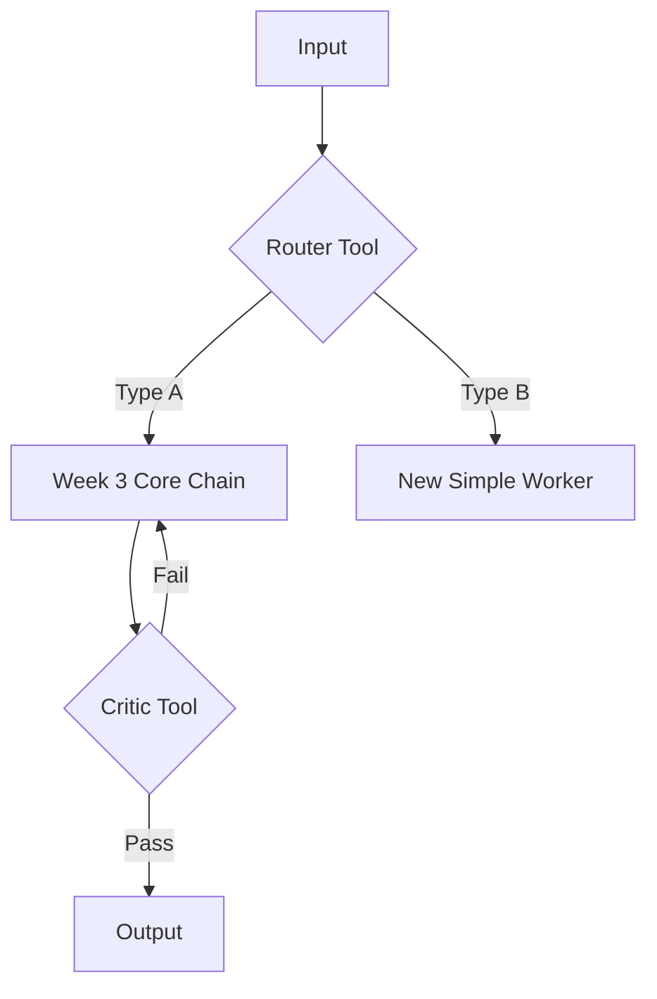

# Process Design Document (PDD) - Working Draft
**Team Name:**
**Project Title:**
**Current Phase:** Week 4 (Advanced Logic Design)

> *This version assumes you already completed the week 2 and week 3 portions. Copy them in the respective sections.*
---

## [Part 1: Process Analysis]
*(Retain your Week 2 content: As-Is Map, Business Case, etc.)*

---

## [Part 2: The Core Capability (The Linear Worker)]
*(Retain your Week 3 content. This Linear Chain (Gatekeeper -> Judge -> Worker) will likely become one of the "Branches" in your new system.)*

---

## Part 3: The Intelligent Network (Week 4 Additions)

*In Week 4, we wrap the Linear Core in advanced logic to handle variety (Routing) and quality (Looping).*

### 3.1 The Architecture Strategy
*Which Advanced Patterns are you deploying to fix the "Real World Complexity"? Check at least one.*
*   [ ] **The Router (Branching):** To handle different types of inputs (e.g., separating Spam from Valid Requests).
*   [ ] **The Evaluator-Optimizer (Looping):** To ensure quality/safety (e.g., checking the Draft before sending).
*   [ ] **The Orchestrator-Workers (Parallel):** To handle complex, multi-step research.

### 3.2 The Advanced Logic Map (Mermaid)
*(Update your diagram. It should now contain Diamonds (Decisions) or Circles (Loops) wrapping around your nodes.)*

### 3.3 The Orchestrator Logic
*Define the step-by-step execution plan (The "Operating System"). This replaces the simple "1-2-3" sequence.*

> **Example Logic:**
> 1.  **Ingest** user input.
> 2.  **Call** `Intent_Router` tool.
> 3.  **IF** output is "REFUND" (Type A):
>     *   Run Week 3 Core Chain (Gatekeeper -> Judge -> Draft).
>     *   **Loop:** Pass Draft to `Critic_Tool`.
>     *   If `Critic` says FAIL, rewrite draft. Repeat until PASS.
> 4.  **IF** output is "SPAM" (Type B):
>     *   Terminate.
> 5.  **Output** final result.

---

### 3.4 New Component Definitions (The Modules)
*Define the Specs and Prompts for the NEW tools you added (Router or Critic). You do not need to redefine the tools from Part 2.*

#### **[Module A: The Router Configuration]**
*(Fill this if you added a Router)*

*   **Tool Name:** (e.g., Intent Classifier)
*   **Input Variable:** `{{input_text}}`
*   **Output Categories:**
    1.  [Label A] (e.g., REFUND)
    2.  [Label B] (e.g., OTHER)
*   **R.A.F.T. Prompt Draft:**
    > (Paste your System Prompt for the Router here. It must act as a Classifier.)

#### **[Module B: The Evaluator Configuration]**
*(Fill this if you added a Loop)*

*   **Tool Name:** (e.g., Compliance Critic)
*   **Input Variable:** `{{draft_output}}`
*   **Evaluation Rubric:** (What are the specific pass/fail criteria?)
    *   *Rule 1:* (e.g., Must not promise cash refunds > $50)
*   **R.A.F.T. Prompt Draft:**
    > (Paste your System Prompt for the Critic here. It must output PASS/FAIL and Reasoning.)

---

### 3.5 Advanced Simulation Log (Proof of Robustness)
*Provide a chat log showing the Logic handling a complex case.*

**Scenario: The Edge Case**
*   **Input:** (e.g., A Spam message OR a Bad Draft that triggers the Critic)
*   **Trace:**
    *   *Router Output:* ...
    *   *Branch Taken:* ...
    *   *Critic Verdict:* ...
    *   *Final Result:* ...
