# Process Design Document (PDD) - Working Draft
**Team Name:**
**Project Title:**
**Current Phase:** Week 4 (Advanced Logic Design)

> *This version assumes you already completed the week 2 and week 3 portions. Copy them in the respective sections.*
---

## [Part 1: Process Analysis]
*(Retain your Week 2 content: As-Is Map, Business Case, etc.)*

---

## [Part 2: The Core Capability (The Linear Worker)]
*(Retain your Week 3 content. This Linear Chain (Gatekeeper -> Judge -> Worker) will likely become one of the "Branches" in your new system.)*

---

## Part 3: The Intelligent Network (Week 4 Additions)

*In Week 4, we wrap the Linear Core in advanced logic to handle variety (Routing) and quality (Looping).*

### 3.1 The Architecture Strategy
*Which Advanced Patterns are you deploying to fix the "Real World Complexity"? Check at least one.*
*   [X] **The Router (Branching):** To handle different types of inputs (e.g., separating Spam from Valid Requests).
*   [X] **The Evaluator-Optimizer (Looping):** To ensure quality/safety (e.g., checking the Draft before sending).
*   [ ] **The Orchestrator-Workers (Parallel):** To handle complex, multi-step research.

### 3.2 The Advanced Logic Map (Mermaid)
*(Update your diagram. It should now contain Diamonds (Decisions) or Circles (Loops) wrapping around your nodes.)*

```mermaid

graph TD
    A[⚡ Receipt of Vendor CSV / Status Meeting Notes] --> B[📦 Vendor CSV & Meeting Notes]
    B --> R{🧭 Input Qualified?}

    %% Router (New)
    style R fill:#E6FFFA,stroke:#065F46,stroke-width:2px

    R -- Yes --> AI1
    R -- No --> X[⛔ Data Insufficient / Escalate]
    style X fill:#E6FFFA,stroke:#065F46,stroke-width:2px

    %% Existing Week 3 Pipeline
    subgraph Automated_AI_Pipeline["Automated AI Pipeline"]
        AI1[🤖 Gatekeeper: Extraction] --> AI2[⚖️ Judge: Reasoning]
        AI2 --> C{🔍 Preconditions Met?}
        C -- No --> AI2
        C -- Yes --> AI3[✍️ Worker: Drafting]
    end

    %% Critic & Loop (New)
    style C fill:#E6FFFA,stroke:#065F46,stroke-width:2px

    %% Styling for existing Week 3 nodes
    style AI1 fill:#FFF4DD,stroke:#333,stroke-width:2px
    style AI2 fill:#FFF4DD,stroke:#333,stroke-width:2px
    style AI3 fill:#FFF4DD,stroke:#333,stroke-width:2px

    %% Downstream
    AI3 --> F[🛠️ Draft Status Update Email]
    F --> E[🏁 End Process]


```



### 3.3 The Orchestrator Logic
*Define the step-by-step execution plan (The "Operating System"). This replaces the simple "1-2-3" sequence.*

#### WORKFLOW VARIABLES
```
# Inputs
transcript                : String, meeting notes and requests
vendor_csv                : String, vendor transaction data

# Gatekeeper outputs
source_line_item          : String, extracted or inferred
target_line_item          : String, extracted or inferred
requested_shift_amount    : Number, extracted or inferred
current_overhead_reference: Number, extracted or inferred
msa_clause_mention        : Boolean, extracted or inferred
vendor_name               : String
requester_identity        : String
inferred_flags            : Dictionary indicating which fields were inferred

# Judge outputs
judge_verdict             : APPROVE / REJECT
judge_reasoning           : XML or structured reasoning

# Critic outputs
critic_verdict            : APPROVE / REJECT / NEEDS_REVIEW
critic_notes              : Explanation of any violations
```

#### WORKFLOW CONDITIONS
##### Router (Pre-Gatekeeper)
```
IF vendor_csv AND transcript contain all mandatory fields THEN
    router_output = VALID
ELSE IF fields exist but are ambiguous / inferred THEN
    router_output = AMBIGUOUS
ELSE
    router_output = INSUFFICIENT
END IF

# Routing action
IF router_output == VALID THEN
    proceed to Gatekeeper extraction
ELSE IF router_output == AMBIGUOUS THEN
    Gatekeeper extracts fields but marks inferred_flags = true
ELSE
    HALT pipeline, escalate for human review
END IF
```

##### Critic (Post-Judge Evaluator Loop)
```
# Initialize loop
WHILE critic_verdict not APPROVE AND retry_count < MAX_RETRIES
    # Evaluate Judge output against business rules
    IF any mandatory field missing OR critical field inferred THEN
        critic_verdict = REJECT
        critic_notes = "Critical fields missing or inferred"
    ELSE IF requested_shift_amount > 10000 THEN
        critic_verdict = REJECT
        critic_notes = "Budget exceeds $10k limit"
    ELSE IF requested_shift_amount > 5000 AND msa_clause_mention == false THEN
        critic_verdict = REJECT
        critic_notes = "MSA clause missing for shift > $5k"
    ELSE IF target_line_item NOT classified as overhead THEN
        critic_verdict = REJECT
        critic_notes = "Target line item not validated as overhead"
    ELSE
        critic_verdict = APPROVE
        critic_notes = "All preconditions satisfied"
    END IF

    # Feedback to Judge
    IF critic_verdict != APPROVE THEN
        Judge re-evaluates reasoning
        retry_count += 1
    END IF
END WHILE
```

---

### 3.4 New Component Definitions (The Modules)
*Define the Specs and Prompts for the NEW tools you added (Router or Critic). You do not need to redefine the tools from Part 2.*

#### **[Module A: The Router Configuration]**

**Tool Name:** Input Qualification Router
  *   **Input Variable:**
      *   `{{transcript}}` (String), `{{vendor_csv}}` (String)
  *   **Output Categories:** (What are the specific pass/fail criteria?)
      *   VALID
        * Required financial facts are explicitly present in authoritative sources (CSV preferred).
        * Numeric values are concrete (no hedging language).
      * AMBIGUOUS
        * Required facts exist but are vague, approximate, or transcript-only.
        * Extraction is possible only with forced inference flags.
      * INSUFFICIENT
        * One or more mandatory fields cannot be grounded in any source.
        * Downstream automation must fail closed or escalate.
  *   **R.A.F.T. Prompt Draft:**
      ```
      # Role
      You are the Input Qualification Router for a financial automation pipeline.
      
      # Audience
      Machine – your output controls downstream routing logic.
      
      # Format
      Strict JSON with a single required field:
      - `classification` ∈ { "VALID", "AMBIGUOUS", "INSUFFICIENT" }
      
      # Task
      Evaluate the provided inputs to determine whether they are suitable for structured financial extraction.
      
      Classify as:
      - VALID:
        - Required financial facts (amounts, line items, references) are explicit and grounded in authoritative sources (prefer CSV over transcript).
      - AMBIGUOUS:
        - Facts are present but vague, approximate, or expressed only in conversational language (e.g., “maybe ten grand or so”).
      - INSUFFICIENT:
        - One or more mandatory financial facts cannot be located or grounded in any input source.
      
      # Rules
      - Do NOT extract values.
      - Do NOT infer missing data.
      - Do NOT reason about budget limits or approvals.
      - Judge only data sufficiency and clarity.
      ```

#### **[Module B: The Evaluator Configuration]**

*   **Tool Name:** Judge Critic / Evaluator Loop (NEW)
*   **Input Variable:** 
    * {{judge_xml_output}} (XML)
      * <thinking>: Step-by-step reasoning
      * <verdict>: Proposed decision (APPROVE or REJECT)
    * {{gatekeeper_json_output}} (JSON)
      * Structured financial facts, including inferred flags
*   **Evaluation Rubric:** (What are the specific pass/fail criteria?)
    | Rule                                    | Description                                                                                                      |
    | :-------------------------------------- | :--------------------------------------------------------------------------------------------------------------- |
    | **Mandatory Fields Present**            | All critical fields (`requested_shift_amount`, `target_line_item`, `current_overhead_reference`) must exist.     |
    | **No Over-Confidence on Inferred Data** | Fields marked `"inferred": true` must trigger a conditional or REJECT verdict if they are critical for approval. |
    | **Budget Limit Enforcement**            | Requested shift must not exceed $10,000.                                                                         |
    | **MSA Trigger Rule**                    | Any shift > $5,000 must trigger MSA check.                                                                       |
    | **Overhead Qualification**              | `target_line_item` must have a validated overhead classification.                                                |
    | **Fail-Closed Principle**               | If any precondition fails, the final verdict is downgraded to REJECT or NEEDS REVIEW.                            |

*   **R.A.F.T. Prompt Draft:**
    ```
    # Role
    You are the Judge Critic: an Evaluator Loop that validates the Judge node's output against strict business rules.
    
    # Audience
    Machine – your output will either approve, reject, or escalate the Judge's proposed verdict.
    
    # Format
    Strict XML with required tags:
    - <final_verdict> : APPROVE, REJECT, or NEEDS_REVIEW
    - <critic_notes> : Explanation of any precondition failures or policy violations
    
    # Task
    1. Consume Judge XML output and Gatekeeper JSON facts.
    2. Verify:
       - All mandatory fields exist.
       - No critical field is purely inferred.
       - Requested shift ≤ $10,000.
       - MSA clause evaluated for shifts > $5,000.
       - Target line item is validated as overhead.
    3. If any rule is violated:
       - Override the Judge's verdict to REJECT or NEEDS_REVIEW.
       - Record reasoning in <critic_notes>.
    4. If all rules pass, retain the Judge's original verdict in <final_verdict>.
    
    # Rules
    - Always enforce fail-closed for missing or inferred critical data.
    - Never allow APPROVE on incomplete or ambiguous inputs.
    - Provide clear notes to downstream Worker for handling conditional or rejected verdicts.
    ```
  

---

### 3.5 Advanced Simulation Log (Proof of Robustness)
*Provide a chat log showing the Logic handling a complex case.*

**Scenario: The Edge Case**
*   **Input:** 
  ```
  requested_shift_amount = 7000
  target_line_item = LOG-DEP-01
  msa_clause_mention = false
  current_overhead_reference = 7000
  ```
*   **Trace:**
  ```
  [ROUTER] -> VALID
  [Gatekeeper] -> Extracted all fields; inferred_flags = {"msa_clause_mention": true}
  [JUDGE] -> APPROVE
  [CRITIC] -> REJECT (Reason: MSA missing for shift > $5k)
  [JUDGE] -> RETRY reasoning with Critic feedback
  [CRITIC] -> REJECT (Still MSA missing)
  [RESULT] -> FINAL MEMO
  Subject: Budget Shift Request Status – Logistics Line
  Summary:
  Priya requested a budget shift of $7,000 to the logistics line (LOG-DEP-01).
  Decision Outcome:
  The request has been REJECTED due to missing MSA clause for shifts over $5,000.
  Next Steps / Action Items:
  * Clarify MSA clause reference before resubmitting.
  * Do not process allocation until Critic conditions are satisfied.
  ```
* **Observations from Simulation**
  * Router correctly classified input as VALID.
  * Gatekeeper flagged inferred MSA field.
  * Judge initially approved based on raw extracted facts.
  * Critic caught missing MSA and enforced fail-closed.
  * Feedback loop prompted Judge retry, but Critic maintained REJECT due to persistent violation.
  * Final memo reflects safe, auditable, and conditional decision.
